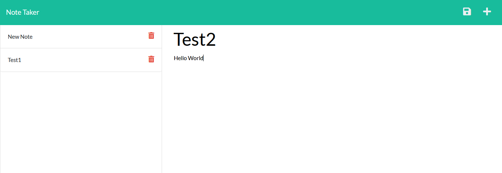
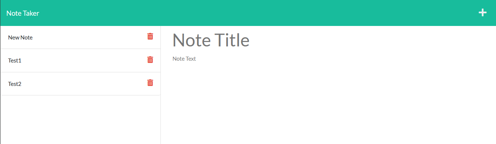

# TS-10-Note-Taker-App-MKII

This project is a basic note taker app, designed to allow the user to input a note with a title and text, and save it to a note list.

The application, deployed to heroku, uses a server to connect several html and api routes that allow the basic html pages to draw information from the database db.json file. By translating the json file to readable javascript, the user's inputs can be saved or read, with functionality for the delete button still being a WIP.

Deployed Application: https://thawing-coast-75228.herokuapp.com/

